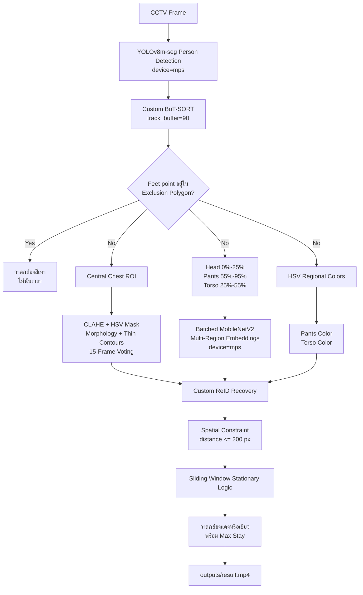

# รายงานการพัฒนา Longest Stay Detection

## 1. บทสรุปโครงการ

โปรเจกต์นี้พัฒนาขึ้นเพื่อวิเคราะห์วิดีโอจากกล้อง CCTV และค้นหาบุคคลที่
**อยู่นิ่งต่อเนื่องนานที่สุด** โดยระบบต้องรับมือกับปัญหาที่เกิดขึ้นจริงบริเวณ
ทางเข้าอาคาร ได้แก่ คนเดินซ้อนกัน การบังกันชั่วคราว (`occlusion`) การสลับ
Track ID (`ID switching`) เสื้อยูนิฟอร์มที่มีสีเหมือนกัน และพื้นที่บางส่วน
ที่ไม่ควรนำมาคำนวณเวลา

ระบบรุ่นล่าสุดไม่ได้พึ่งโมเดลเดียว แต่ใช้หลายกลไกทำงานร่วมกัน:

1. ใช้ YOLOv8 Instance Segmentation ตรวจจับบุคคล
2. ใช้ BoT-SORT ที่ปรับค่าให้จำ Track ที่หายไปได้นานขึ้น
3. ใช้ MobileNetV2 สกัด Multi-Region Embeddings สำหรับ Custom Re-Identification
4. ใช้ตำแหน่งบนภาพเป็นข้อจำกัดทางฟิสิกส์ ป้องกันการจับคู่คนที่ดูเหมือนกัน
   แต่เคลื่อนที่ไกลผิดธรรมชาติ
5. ใช้สีเสื้อบริเวณลำตัวเป็น fallback feature
6. ใช้ Shape-Aware Lanyard Color เป็น auxiliary tie-breaker
7. ใช้ Polygon Exclusion Zone ตัดบุคคลภายในพื้นที่ที่กำหนดออกจากการคำนวณ
8. ใช้ Sliding Window Distance Thresholding วัดเวลาที่บุคคลอยู่นิ่ง
9. ใช้ `device="mps"` สำหรับเร่ง inference บน Apple Silicon

โครงสร้างนี้เหมาะกับข้อจำกัดของ Hackathon 24 ชั่วโมง เพราะแต่ละส่วนแยกจากกัน
และสามารถทดลองเปลี่ยน Detector, Tracker และ ReID ได้โดยไม่ต้องเขียน pipeline
ใหม่ทั้งหมด

---

## 2. ข้อมูลวิดีโอและ Output

วิดีโอที่ใช้ทดสอบในเครื่อง:

| รายการ | ค่า |
| --- | --- |
| Input | `data/entrance.mov` |
| Resolution | `1920 x 1080` |
| FPS จาก metadata | `29.8825` |
| จำนวนเฟรม | `2556` |
| ความยาววิดีโอ | `85.53 วินาที` |
| ขนาดไฟล์ | ประมาณ `90 MB` |

ไฟล์ Output ที่ระบบสร้าง:

| ไฟล์ | หน้าที่ |
| --- | --- |
| `outputs/result.mp4` | วิดีโอที่วาด Bounding Box, Track ID, สีสายคล้องคอ, เวลานิ่งสูงสุด และ Exclusion Zone |
| `outputs/experiments_result.csv` | ผล Grid Search รุ่นแรก จำนวน 6 combinations บนช่วง 150 เฟรม |
| `outputs/evaluation_metrics.csv` | ผลเปรียบเทียบ Baseline, Intermediate และ Ours บนช่วง 300 เฟรม |

ไฟล์วิดีโอ, model weights และ output ทั้งหมดถูก ignore ด้วย `.gitignore`
เพื่อไม่อัปโหลดข้อมูล CCTV หรือไฟล์ขนาดใหญ่ขึ้น GitHub โดยไม่ตั้งใจ

> หมายเหตุ: `outputs/result.mp4` เป็น generated artifact ในเครื่อง หากแก้
> pipeline แล้วต้องการวิดีโอที่ตรงกับโค้ดล่าสุด ควรรัน `python main.py`
> ใหม่อีกครั้ง

---

## 3. Architecture ปัจจุบัน



โมดูลหลัก:

| ไฟล์ | ความรับผิดชอบ |
| --- | --- |
| `src/detector.py` | โหลด YOLO และรัน tracking เฉพาะ class `person` |
| `custom_botsort.yaml` | ปรับ BoT-SORT สำหรับ occlusion |
| `src/reid.py` | สกัด normalized Head, Pants และ Torso Embeddings ด้วย MobileNetV2 แบบ batched |
| `src/features.py` | สกัด Pants/Torso Color และ Shape-Aware Lanyard Color |
| `src/logic.py` | จัดการ Stationary State, orphan tracks, Custom ReID และ fallback matching |
| `src/utils.py` | คำนวณ centroid, feet point, polygon test และวาดข้อมูลลงเฟรม |
| `main.py` | เชื่อมทุกโมดูลเข้าด้วยกันและ render วิดีโอ |
| `experiments.py` | Grid Search เบื้องต้นของ detector และ tracker |
| `evaluate_metrics.py` | เปรียบเทียบ pipeline 3 ระดับอย่างอัตโนมัติ |

---

## 4. ลำดับการพัฒนาและสิ่งที่เปลี่ยน

### 4.1 รุ่นเริ่มต้น: Bounding Box Detection + Tracker

รุ่นแรกใช้ YOLO Object Detection ดึง Bounding Box ของบุคคล และใช้ Track ID
จาก ByteTrack หรือ BoT-SORT โดยตรง จากนั้นคำนวณ centroid ของแต่ละกล่อง:

```text
centroid = [(x1 + x2) / 2, (y1 + y2) / 2]
```

ข้อดี:

- เร็ว
- โค้ดตรงไปตรงมา
- ใช้เป็น baseline สำหรับเปรียบเทียบได้ดี

ข้อจำกัด:

- เมื่อคนเดินซ้อนกัน กล่องของคนแต่ละคนอาจทับกันมาก
- Tracker อาจสร้าง ID ใหม่หลัง occlusion
- เวลานิ่งของคนเดียวกันอาจถูกแบ่งออกเป็นหลายช่วง เพราะ ID เปลี่ยน

### 4.2 เพิ่ม Sliding Window Stationary Analysis

การนิยามว่า “นิ่ง” ด้วยความเร็วเท่ากับศูนย์ใช้ไม่ได้จริง เนื่องจาก Bounding Box
ของ Detector มี jitter แม้ว่าคนจะยืนอยู่กับที่ ระบบจึงใช้ประวัติตำแหน่งแบบ
Sliding Window:

1. เก็บ centroid ล่าสุดไว้ใน `collections.deque`
2. กำหนด window ประมาณ `1 วินาที`
3. คำนวณค่าเฉลี่ยตำแหน่งใน window
4. วัด Euclidean distance ระหว่าง centroid ปัจจุบันกับค่าเฉลี่ย
5. ถ้าระยะต่ำกว่า `25 pixels` ให้สะสม stationary frame counter
6. ถ้าระยะเกิน threshold ให้รีเซ็ต counter ปัจจุบัน แต่เก็บ `max_frames`

สมการ:

```text
distance = sqrt((x_current - x_mean)^2 + (y_current - y_mean)^2)
```

ข้อดีของแนวทางนี้คือทนต่อ jitter เล็กน้อย และยังคงวัดเวลานิ่งต่อเนื่องได้
โดยไม่ไวเกินไปต่อการแกว่งของ Bounding Box

### 4.3 ทดลอง Detector และ Tracker หลาย Combination

ไฟล์ `experiments.py` ถูกสร้างขึ้นเพื่อเปรียบเทียบโมเดลและ tracker แบบอัตโนมัติ
บน 150 เฟรมแรก:

- YOLOv8n
- YOLOv8m
- YOLO11m
- ByteTrack
- BoT-SORT

เป้าหมายคือหา trade-off ระหว่าง:

- ความเร็ว (`Processing FPS`)
- จำนวน Track ID ที่เกิดขึ้น (`Total Unique IDs`)

โดยทั่วไป หากจำนวนคนจริงในฉากคงที่ ค่า `Total Unique IDs` ที่ต่ำกว่ามักบอกว่า
มี fragmentation หรือ ID switch น้อยกว่า อย่างไรก็ตาม metric นี้ไม่ใช่
Ground Truth ID Accuracy โดยตรง

### 4.4 จาก Lanyard Color เป็น Torso Color

แนวคิดแรกใช้สีสายคล้องคอเป็น appearance feature แต่พบปัญหา:

- สายคล้องคอมีขนาดเล็ก
- เงาและ motion blur ทำให้สีเพี้ยนง่าย
- เมื่อคนหันหลัง สายอาจมองไม่เห็น
- Bounding Box jitter เพียงเล็กน้อยก็ทำให้ crop หลุดจาก feature

จึงเปลี่ยนเป็น `AppearanceExtractor` ใน `src/features.py` และใช้พื้นที่ลำตัว:

```text
torso_y1 = y1 + 25% ของความสูงกล่อง
torso_y2 = y1 + 75% ของความสูงกล่อง
```

จากนั้นแปลง ROI เป็น HSV และใช้ `cv2.inRange` ตรวจ 6 สี:

- Red
- Blue
- Green
- Yellow
- Orange
- Purple

Torso Color มีพื้นที่ใหญ่กว่าและทนต่อ shadow หรือการหันตัวได้ดีกว่า Lanyard
Color จึงเหมาะสำหรับเป็น fallback feature

### 4.5 จาก Object Detection เป็น Instance Segmentation

Detector หลักถูกเปลี่ยนจาก `yolov8m.pt` เป็น `yolov8m-seg.pt`

เหตุผล:

- Object Detection ให้ข้อมูลระดับ Bounding Box
- Instance Segmentation แยก mask ของแต่ละคนได้ละเอียดกว่า
- เมื่อคนซ้อนกัน ขอบเขต object มีโอกาสเสถียรกว่า
- Tracker มีข้อมูล Detection ที่เหมาะกับฉาก occlusion มากขึ้น

แม้ pipeline ปัจจุบันยังใช้ Bounding Box จากผล segmentation ในการคำนวณ
centroid และ crop ROI แต่ detector รุ่น segmentation ช่วยปรับคุณภาพของ
การแยก instance ตั้งแต่ต้นทาง

### 4.6 ปรับ BoT-SORT สำหรับ Occlusion

สร้างไฟล์ `custom_botsort.yaml` เพื่อใช้แทนค่า default:

| Parameter | ค่า | เหตุผล |
| --- | --- | --- |
| `tracker_type` | `botsort` | ใช้ BoT-SORT เป็น tracker หลัก |
| `track_high_thresh` | `0.4` | รับ detection ที่มีความมั่นใจเหมาะสมเข้าสู่ matching |
| `track_low_thresh` | `0.1` | เปิดโอกาสให้ detection confidence ต่ำช่วยรักษา track |
| `new_track_thresh` | `0.7` | ลดการสร้าง ID ใหม่จาก detection ที่ยังไม่มั่นใจ |
| `track_buffer` | `90` | จำ lost track ได้นานประมาณ 3 วินาทีที่ 30 FPS |
| `match_thresh` | `0.8` | ปรับ threshold สำหรับ matching |
| `gmc_method` | `sparseOptFlow` | ใช้ optical flow ช่วยชดเชยการเคลื่อนที่ของภาพ |
| `with_reid` | `false` | ปิด internal ReID เพราะใช้โมดูล Custom ReID แยกต่างหาก |

`track_buffer: 90` เป็นค่าที่สำคัญมากสำหรับทางเข้าอาคาร เพราะการเดินสวนหรือ
บังกันมักกินเวลาหลายสิบเฟรม หาก buffer สั้นเกินไป Tracker จะทิ้ง ID เดิมเร็ว
และสร้าง ID ใหม่

### 4.7 เพิ่ม Custom ReID ด้วย MobileNetV2

เพิ่ม `src/reid.py` เพื่อสร้าง appearance embedding แยกจาก BoT-SORT:

1. โหลด `torchvision.models.mobilenet_v2(weights="DEFAULT")`
2. ตัด classifier head ด้วย `nn.Identity()`
3. ย้ายโมเดลไป `device="mps"`
4. ตั้ง `eval()`
5. Crop หลาย ROI ได้แก่ Head, Pants และ Torso
6. Resize แต่ละ crop เป็น `256 x 128`
7. แปลง BGR เป็น RGB
8. Normalize ด้วย ImageNet mean และ standard deviation
9. รวม ROI ที่ valid เป็น batch เดียว
10. Forward pass บน MPS ด้วย `torch.inference_mode()`
11. Normalize embedding แต่ละ region ด้วย L2 norm
12. Detach embeddings กลับมาไว้บน CPU

การแยกโมดูล Custom ReID ทำให้ควบคุมกติกาการ merge ID ได้ละเอียดกว่าเปิด ReID
ภายใน tracker อย่างเดียว

### 4.8 จาก Head-Only เป็น Pants-First Multi-Region Embedding

Whole-body appearance embedding ยังมีข้อจำกัดเมื่อทุกคนใส่ยูนิฟอร์มเหมือนกัน
เพราะพื้นที่เสื้อกินสัดส่วนภาพมากและทำให้ embedding ของคนหลายคนคล้ายกัน

แนวทางนี้ได้รับแรงบันดาลใจจากงานวิจัย
[*Person in Uniforms Re-Identification*](https://doi.org/10.1145/3703839)
ใน ACM Transactions on Multimedia Computing, Communications, and Applications
ซึ่งเสนอแนวคิด Uniform Feature Separation เพื่อลดอิทธิพลของฟีเจอร์ยูนิฟอร์ม
และให้ความสำคัญกับ non-uniform cues มากขึ้น

สำหรับ Hackathon 24 ชั่วโมงนี้ เราไม่ได้ reproduce learned feature separation,
orthogonal constraints หรือ training pipeline ของ paper โดยตรง แต่สร้าง
**practical real-time heuristic** ที่ลดน้ำหนักบริเวณเสื้อซึ่งเป็นยูนิฟอร์ม
และเน้นบริเวณที่แตกต่างกันจริงในวิดีโอนี้

การทดลองพบข้อมูล domain-specific เพิ่มเติม: ทุกคนใส่เสื้อเหมือนกัน แต่กางเกง
แตกต่างกัน จึงใช้สาม ROI ใน `CustomReID.get_embedding()`:

```text
Head:  0%-25%  ของความสูง Bounding Box
Pants: 55%-95% ของความสูง Bounding Box
Torso: 25%-55% ของความสูง Bounding Box
```

น้ำหนัก similarity:

```text
multi_region_similarity =
    0.25 * head_similarity
  + 0.60 * pants_similarity
  + 0.15 * torso_similarity
```

หากบาง region ถูกบัง ระบบจะใช้เฉพาะ region ที่มี embedding และ normalize
น้ำหนักใหม่ตาม region ที่ใช้งานได้

ข้อดี:

- Pants Embedding เป็น cue หลัก เพราะกางเกงแตกต่างกันและมีพื้นที่ pixel มาก
- Head Embedding ช่วยแยกกรณีที่กางเกงใกล้เคียงกัน
- Torso Embedding ยังมีไว้เป็น fallback แต่ให้น้ำหนักต่ำ เพราะเสื้อเหมือนกัน
- ส่งทั้งสาม crop เข้า MobileNetV2 เป็น batch เดียว ลด overhead ของ model launch
- Pants HSV Color ช่วยลงโทษ match ที่กางเกงคนละสี และใช้เป็น fallback ได้

ข้อควรระวัง:

- นี่คือ regional appearance embedding ไม่ใช่ระบบ Face Recognition
- หากขาถูกบัง Pants Embedding อาจหายไป ระบบจะ fallback ไป region อื่น
- MobileNetV2 ที่ใช้ weights ทั่วไปไม่ได้ fine-tune บน person ReID dataset

### 4.9 เพิ่ม Spatial-Temporal Constraint ป้องกัน Teleport

การเทียบ embedding อย่างเดียวอาจ merge ผิด เมื่อคนหลายคนมี appearance
คล้ายกัน ระบบจึงเพิ่มข้อจำกัดด้านตำแหน่งใน `src/logic.py`

กติกานี้ทำหน้าที่เสริม Pants-First Multi-Region ReID: regional embeddings
ลด uniform bias ขณะที่ Spatial-Temporal Distance Penalty ลดโอกาสจับคู่ผิด
ระหว่างคนที่มีลักษณะคล้ายกัน แต่อยู่คนละตำแหน่งในฉาก

ขั้นตอน recovery:

1. เทียบ embedding ปัจจุบันกับ orphan track ทุกตัวด้วย cosine similarity
2. อ่าน centroid ล่าสุดของ orphan track
3. วัดระยะห่างบนภาพ
4. ถ้าระยะเกิน `200 pixels` ให้ตัด candidate ทิ้งทันที
5. ถ้าระยะไม่เกิน threshold ให้หัก distance penalty
6. เลือก candidate ที่มี final score สูงที่สุด
7. Merge เมื่อ final score ตั้งแต่ `0.70` ขึ้นไป

สมการ:

```text
if distance > 200:
    reject candidate

distance_penalty = distance / 1000
pants_color_penalty = 0.15 หากสีที่ทราบแตกต่างกัน
final_score = multi_region_similarity - distance_penalty - pants_color_penalty
```

เหตุผลเชิงฟิสิกส์:

- คนที่หายไปเพียงช่วงสั้นไม่ควรปรากฏอีกมุมหนึ่งของภาพแบบทันที
- embedding ที่คล้ายกันแต่ตำแหน่งห่างควรมีความน่าเชื่อถือลดลง
- ช่วยลด false merge เมื่อหลายคนใส่ชุดคล้ายกัน

### 4.10 เพิ่ม Shape-Aware Lanyard Color Extractor

แม้ Pants-First ReID จะเหมาะกับวิดีโอนี้มากกว่า แต่สายคล้องคอยังมีประโยชน์เป็น
auxiliary cue ในบางเฟรม ปัญหาคือเสื้อของผู้เข้าร่วมเป็นโทนฟ้าและน้ำเงิน หากนับ
จำนวน pixel สีแบบตรงไปตรงมา ระบบอาจเข้าใจผิดว่าสีเสื้อคือสีสายคล้องคอ

จึงเพิ่ม `LanyardExtractor` แยกจาก `AppearanceExtractor` โดยไม่ใช้ dominant
color ของ ROI กว้าง แต่ใช้ image processing pipeline ดังนี้:

1. Crop เฉพาะกลางอกด้านบน:
   - แกน X: `30%-70%` ของความกว้าง Bounding Box
   - แกน Y: `18%-52%` ของความสูง Bounding Box
2. แปลง ROI จาก BGR เป็น HSV
3. ใช้ CLAHE กับ channel `V` เพื่อลดผลกระทบจากเงา
4. สร้าง mask สำหรับ Red, Blue, Green, Yellow, Orange และ Purple
5. ใช้ Morphological Opening ลบ noise ขนาดเล็ก
6. ใช้ Morphological Closing เชื่อมส่วนของสายที่ขาดจากเงาหรือ motion blur
7. หา contours และเก็บเฉพาะ component ที่มีลักษณะคล้ายสาย:
   - `0.002 <= area_ratio <= 0.18`
   - `aspect_ratio >= 1.8`
   - อยู่ไม่ไกลจากแกนกลางของอก
8. Reject mask ขนาดใหญ่ที่น่าจะเป็นเสื้อ:
   - Blue coverage ต้องไม่เกิน `25%` ของ ROI
   - สีอื่นต้องไม่เกิน `35%` ของ ROI
9. เก็บผลย้อนหลัง `15` เฟรมต่อ Track ID และเลือกสีด้วย majority vote

Lanyard Color ถูกใช้แบบอนุรักษ์นิยม:

```text
หาก pants color ต่างกัน:
    color_penalty += 0.15

หาก lanyard color ที่ทราบแน่นอนต่างกัน:
    color_penalty += 0.05
```

น้ำหนักของ lanyard ต่ำกว่า pants อย่างตั้งใจ เพราะสายคล้องคอมีขนาดเล็ก
ถูกบังง่าย และอาจมองไม่เห็นเมื่อคนหันหลัง หาก ReID embedding match ไม่สำเร็จ
ระบบ fallback ตามลำดับ:

```text
Pants Color -> Lanyard Color -> Torso Color
```

### 4.11 เพิ่ม EMA สำหรับ Embedding แต่ละ Region

ระบบไม่แทนที่ embedding เดิมด้วยภาพล่าสุดทันที แต่ใช้ Exponential Moving
Average:

```text
new_region_embedding =
    normalize(0.9 * old_region_embedding + 0.1 * current_region_embedding)
```

ข้อดี:

- ลดผลกระทบจาก motion blur
- ลดผลกระทบจากเฟรมที่ใบหน้าถูกบังบางส่วน
- ทำให้ identity representation เสถียรกว่าการใช้ภาพล่าสุดเพียงเฟรมเดียว

### 4.12 จำกัดอายุ Orphan Track

Orphan track จะใช้สำหรับ recovery ได้ไม่เกินประมาณ 3 วินาที:

```text
max_orphan_frames = fps * 3
```

เมื่อหมดอายุ ระบบจะย้าย track ไป `completed_tracks`:

- ไม่ใช้ match กับคนใหม่อีก
- ยังเก็บ `max_frames` เพื่อสรุป longest stay ท้ายวิดีโอ

เหตุผลคือ หากเก็บ orphan embedding ไว้ตลอดวิดีโอ คนใหม่ที่เข้ามาภายหลังและ
มีลักษณะคล้ายกันอาจถูก merge เข้ากับคนเก่าอย่างผิดพลาด

### 4.13 เพิ่ม ROI Exclusion Zone

บางพื้นที่ในภาพไม่ควรนำมาคำนวณเวลานิ่ง จึงเพิ่ม polygon ที่ปรับตามมุมกล้อง:

```python
EXCLUSION_POLYGON = np.array(
    [[421, 901], [890, 811], [932, 124], [461, 39]],
    dtype=np.int32,
)
```

ระบบใช้จุดใต้เท้าของบุคคล:

```text
feet_point = ((x1 + x2) / 2, y2)
```

จากนั้นตรวจด้วย:

```text
cv2.pointPolygonTest(polygon, feet_point, False) > 0
```

เหตุผลที่ใช้ feet point แทน centroid:

- ตำแหน่งเท้าสื่อถึงพื้นที่ที่คนยืนอยู่ได้ดีกว่า
- Bounding Box อาจคร่อมขอบ zone แม้ว่าคนจะยืนอยู่ด้านใดด้านหนึ่งชัดเจน
- ใช้ `> 0` เพื่อให้เฉพาะจุดที่อยู่ข้างในจริงเท่านั้นถูก exclude
  ส่วนจุดบนเส้นขอบจะยังไม่นับว่าอยู่ภายใน

---

## 5. ลำดับการทำงานต่อหนึ่งเฟรม

เมื่อรัน `python main.py` ระบบทำงานดังนี้:

1. อ่านเฟรมจาก `data/entrance.mov`
2. ส่งเฟรมเข้า `PersonDetector("yolov8m-seg.pt")`
3. รัน YOLO tracking ด้วย `custom_botsort.yaml`
4. วาดเส้น Polygon Exclusion Zone
5. อ่าน Bounding Box และ Track ID ของทุกคน
6. คำนวณ feet point ของแต่ละ Bounding Box
7. หาก feet point อยู่ใน polygon:
   - วาดกล่องสีเทา
   - แสดงข้อความ `EXCLUDED`
   - ไม่สร้าง embedding
   - ไม่อัปเดต stationary timer
8. หากอยู่นอก polygon:
   - คำนวณ centroid
   - สกัด Torso Color, Pants Color และ Shape-Aware Lanyard Color
   - สกัด Head, Pants และ Torso Embeddings ด้วย batched MPS inference
   - พยายาม recover ID ด้วย distance-penalized cosine similarity
   - fallback ตามลำดับ Pants Color, Lanyard Color และ Torso Color
   - อัปเดต embedding ของแต่ละ region ด้วย EMA
   - อัปเดต sliding-window stationary state
9. วาด Bounding Box และข้อมูลลงบนเฟรม
10. เขียนเฟรมลง `outputs/result.mp4`
11. เมื่อจบวิดีโอ พิมพ์ ID และเวลาของบุคคลที่อยู่นิ่งนานที่สุด

---

## 6. ความหมายของภาพใน `outputs/result.mp4`

| สีหรือข้อความ | ความหมาย |
| --- | --- |
| เส้น Polygon สีเทา | ขอบเขตพื้นที่ที่ไม่ต้องนำมาคำนวณ |
| Bounding Box สีเทา + `EXCLUDED` | บุคคลอยู่ใน Exclusion Zone จึงไม่นับเวลา |
| Bounding Box สีเขียว | บุคคลกำลังเคลื่อนที่ หรือ history ยังไม่เต็ม window |
| Bounding Box สีแดง | บุคคลอยู่ในสถานะ stationary |
| `ID: ...` | Track ID ปัจจุบันจาก tracker |
| `Lanyard: ...` | สีสายคล้องคอจาก thin-component detection และ temporal voting |
| `Max Stay: ...s` | เวลานิ่งต่อเนื่องสูงสุดของ identity นั้น |

ตัวอย่าง label:

```text
ID: 12 | Lanyard: Red | Max Stay: 8.47s
```

ข้อสำคัญ: Track ID ที่แสดงบนวิดีโออาจเปลี่ยนหลัง tracker สร้าง ID ใหม่ แต่
Custom ReID จะพยายามย้าย stationary history จาก ID เดิมไปยัง ID ใหม่ เพื่อให้
เวลา longest stay ไม่เริ่มนับใหม่โดยไม่จำเป็น

---

## 7. ผล Grid Search รุ่นแรก: `outputs/experiments_result.csv`

ผลต่อไปนี้วัดจาก 150 เฟรมแรก:

| Detection Model | Tracker | Frames | Processing FPS | Total Unique IDs |
| --- | --- | ---: | ---: | ---: |
| `yolov8n.pt` | `bytetrack.yaml` | 150 | 30.36 | 13 |
| `yolov8n.pt` | `botsort.yaml` | 150 | 28.76 | 12 |
| `yolov8m.pt` | `bytetrack.yaml` | 150 | 21.49 | 22 |
| `yolov8m.pt` | `botsort.yaml` | 150 | 17.58 | 20 |
| `yolo11m.pt` | `bytetrack.yaml` | 150 | 21.69 | 18 |
| `yolo11m.pt` | `botsort.yaml` | 150 | 19.22 | 17 |

### 7.1 สิ่งที่สังเกตได้

1. `yolov8n.pt + bytetrack.yaml` เร็วที่สุดที่ `30.36 FPS`
2. เมื่อใช้ detector เดียวกัน BoT-SORT ลดจำนวน ID ลงเล็กน้อยทุกกรณี:
   - YOLOv8n: `13 -> 12`
   - YOLOv8m: `22 -> 20`
   - YOLO11m: `18 -> 17`
3. BoT-SORT มีต้นทุนความเร็วเพิ่มขึ้นเมื่อเทียบกับ ByteTrack
4. โมเดลขนาดใหญ่ไม่ได้แปลว่าจะมีจำนวน Track ID ต่ำลงเสมอ เพราะ confidence,
   detection fragmentation และพฤติกรรม matching ส่งผลร่วมกัน

### 7.2 วิธีอ่านผลอย่างระมัดระวัง

`Total Unique IDs` เป็น proxy metric:

- จำนวนต่ำลงมักดี หากจำนวนคนจริงในวิดีโอไม่ได้ลดลง
- แต่จำนวนต่ำเกินไปอาจเกิดจาก missed detections หรือ merge คนผิด
- จึงควรดูวิดีโอ output และ Ground Truth ด้วยสายตาประกอบ

---

## 8. ผล Evaluation Pipeline ล่าสุด: `outputs/evaluation_metrics.csv`

ไฟล์ `evaluate_metrics.py` เปรียบเทียบ 3 ระดับของ pipeline บน 300 เฟรมแรก:

| Experiment | Detection Model | Tracker | Custom ReID | Raw Tracker IDs | Logical IDs After Recovery | ReID Merges | Average FPS |
| --- | --- | --- | --- | ---: | ---: | ---: | ---: |
| Config A (Baseline) | `yolov8m.pt` | `bytetrack.yaml` | ปิด | 40 | 40 | 0 | 20.95 |
| Config B (Intermediate) | `yolov8m-pose.pt` | `botsort.yaml` | ปิด | 20 | 20 | 0 | 18.12 |
| Config C (Ours) | `yolov8m-seg.pt` | `custom_botsort.yaml` | เปิด | 11 | 10 | 1 | 8.45 |

### 8.1 Config A: Baseline

ส่วนประกอบ:

- YOLOv8m Object Detection
- ByteTrack
- ไม่มี Custom ReID

ผล:

- เร็วที่สุดในชุด evaluation ที่ `20.95 FPS`
- สร้าง `40 raw IDs`

การตีความ:

- เหมาะเป็น baseline ด้าน speed
- จำนวน IDs สูง สะท้อนว่า pipeline ไวต่อ fragmentation และ ID switching
  ในฉากที่คนบังกัน

### 8.2 Config B: Intermediate

ส่วนประกอบ:

- YOLOv8m Pose
- BoT-SORT ค่า default
- ไม่มี Custom ReID

ผล:

- ความเร็ว `18.12 FPS`
- สร้าง `20 raw IDs`

เมื่อเทียบกับ Baseline:

- จำนวน IDs ลดลง `50.0%`
- FPS ลดลงประมาณ `13.5%`

การตีความ:

- BoT-SORT ช่วยรักษา identity ได้ดีกว่า ByteTrack ในฉาก occlusion
- มีต้นทุนด้าน latency แต่ได้ความต่อเนื่องของ tracking เพิ่มขึ้นชัดเจน

### 8.3 Config C: Ours

ส่วนประกอบ:

- YOLOv8m Instance Segmentation
- Custom BoT-SORT
- Lost-track buffer `90` เฟรม
- Custom MobileNetV2 Pants-First Multi-Region ReID
- Spatial constraint และ distance penalty
- Pants Color fallback, Shape-Aware Lanyard tie-breaker และ Torso Color fallback

ผล:

- ความเร็ว `8.45 FPS`
- สร้าง `11 raw IDs`
- เหลือ `10 logical IDs` หลัง Custom ReID recovery
- เกิด `1 ReID merge`

เมื่อเทียบกับ Baseline:

- จำนวน IDs ลดลง `72.5%`
- Logical IDs หลัง recovery ลดลง `75.0%`
- FPS ลดลงประมาณ `59.7%`

เมื่อเทียบกับ Intermediate:

- จำนวน IDs ลดลง `45.0%`
- Logical IDs หลัง recovery ลดลง `50.0%`
- FPS ลดลงประมาณ `53.4%`

การตีความ:

- Pipeline ล่าสุดให้ความสำคัญกับ ID consistency มากกว่าความเร็วสูงสุด
- จำนวน raw tracker IDs ลดลงมาก แสดงว่า segmentation และ tuned BoT-SORT
  ช่วยลด fragmentation ได้ดีในช่วงทดสอบ
- Custom ReID เพิ่มต้นทุน latency แต่ช่วยสืบทอด stationary history เมื่อ
  tracker ยังเกิด ID switch

### 8.4 การแยก Raw Tracker IDs และ Logical IDs

`evaluate_metrics.py` รายงาน metric สองระดับแยกกันแล้ว:

- `Raw Tracker IDs` คือจำนวน Track ID ที่ detector/tracker สร้างขึ้น:

```python
unique_track_ids.update(active_ids)
```

- `Logical IDs After Recovery` คือจำนวน `TrackState` ที่เหลือหลัง Custom ReID
  recovery รวม active, orphaned และ completed states:

```python
tracker_logic.get_total_logical_ids()
```

ดังนั้นผล Config C รอบล่าสุดแปลได้ว่า:

- YOLOv8m-seg และ Custom BoT-SORT สร้าง `11 raw IDs`
- Custom ReID merge raw fragment ได้ `1` ครั้ง
- หลัง recovery เหลือ `10 logical IDs`
- Config A และ Config B ไม่มี Custom ReID ค่า logical IDs จึงเท่ากับ raw IDs
- ค่า FPS ของ Config C รวม Custom ReID overhead แล้ว

metric ใหม่ช่วยแสดงผลของ recovery โดยตรงขึ้น แต่ยังเป็น proxy metric เพราะไม่มี
Ground Truth ยืนยันว่า merge ถูกคนทุกครั้ง หากมีเวลาเพิ่ม ควรเพิ่ม metric:

- `Rejected Teleport Matches`
- `Longest Stay Error เทียบ Ground Truth`
- `IDF1`, `HOTA` หรือ `MOTA` หากมี annotation

---

## 9. เปรียบเทียบ Output แต่ละประเภท

### 9.1 `outputs/result.mp4`

ตอบคำถามเชิง visual:

- Tracker ตามคนต่อเนื่องหรือไม่
- มี ID switch ตอนคนซ้อนกันหรือไม่
- Exclusion Zone ครอบคลุมพื้นที่ที่ต้องการตัดออกถูกต้องหรือไม่
- กล่องเปลี่ยนเป็นสีแดงเมื่อคนหยุดนิ่งหรือไม่
- ค่า `Max Stay` สอดคล้องกับสิ่งที่เห็นหรือไม่

เหมาะสำหรับ:

- Demo ต่อกรรมการ
- ตรวจ error ด้วยสายตา
- หาเฟรมที่ต้องปรับ threshold

ข้อจำกัด:

- ต้องใช้คนดูวิดีโอ
- ไม่ใช่ metric เชิงตัวเลข
- ต้อง render ใหม่หลังแก้ pipeline

### 9.2 `outputs/experiments_result.csv`

ตอบคำถามเชิง exploratory:

- Detector และ tracker combination ใดเร็ว
- ByteTrack กับ BoT-SORT ต่างกันแค่ไหน
- โมเดลเล็กหรือใหญ่มีผลต่อจำนวน ID อย่างไร

เหมาะสำหรับ:

- Grid Search เบื้องต้น
- เลือก direction ก่อนลงทุนทำ Custom ReID

ข้อจำกัด:

- วัดเพียง 150 เฟรม
- ยังไม่รวม Segmentation, Custom ReID และ ROI Exclusion Zone

### 9.3 `outputs/evaluation_metrics.csv`

ตอบคำถามเชิง ablation:

- การเพิ่มความซับซ้อนแต่ละระดับช่วยลด raw Track IDs เท่าไร
- Custom ReID ลดจำนวน logical identities ต่อจาก raw Track IDs ได้เท่าไร
- Accuracy proxy แลกกับ FPS มากแค่ไหน
- Pipeline ล่าสุดมี overhead มากน้อยเพียงใด

เหมาะสำหรับ:

- สรุปผลใน Hackathon
- ทำตารางเปรียบเทียบ Baseline, Intermediate และ Ours
- อธิบาย engineering trade-off

ข้อจำกัด:

- วัดเพียง 300 เฟรม
- ยังไม่มี Ground Truth annotation
- Logical IDs หลัง recovery ยังเป็น state-count proxy ไม่ใช่ Ground Truth ID accuracy
- ค่า FPS ของ Config C รวม Custom ReID แต่ baseline ไม่มี overhead นี้
  ซึ่งเป็นการเปรียบเทียบ end-to-end ที่ตั้งใจไว้

---

## 10. สรุป Trade-off

| Pipeline | จุดเด่น | จุดด้อย | เหมาะกับ |
| --- | --- | --- | --- |
| Baseline | เร็วที่สุดและเรียบง่าย | ID switching สูง | Prototype และ speed baseline |
| Intermediate | ลด ID fragmentation โดยไม่เพิ่มโมดูลเอง | ช้าลง และยังรับมือยูนิฟอร์มเหมือนกันได้จำกัด | Tracking ทั่วไปที่มี occlusion ระดับกลาง |
| Ours | ลด raw IDs ได้มากที่สุด และรักษา stationary history หลัง ID switch | FPS ลดลงจาก Segmentation และ MobileNetV2 inference ต่อคน | Hackathon demo ที่ให้ความสำคัญกับ longest-stay correctness |

ผลการทดลองชี้ให้เห็นว่า pipeline ล่าสุดไม่ได้ชนะด้าน FPS แต่ชนะด้านความ
ต่อเนื่องของ tracking ซึ่งตรงกับโจทย์ Longest Stay Detection มากกว่า เพราะ
การสลับ ID เพียงครั้งเดียวสามารถทำให้เวลานิ่งของบุคคลหนึ่งถูกแบ่งและรายงานต่ำ
กว่าความจริงได้

---

## 11. วิธีรัน

### 11.1 ติดตั้ง Dependencies

```bash
python3 -m venv .venv
source .venv/bin/activate
pip install --upgrade pip
pip install -r requirements.txt
```

### 11.2 ตรวจ Apple Silicon MPS

```bash
python -c "import torch; print(torch.backends.mps.is_available())"
```

ค่าที่ต้องการ:

```text
True
```

### 11.3 Render วิดีโอหลัก

```bash
python main.py
```

Output:

```text
outputs/result.mp4
```

### 11.4 รัน Grid Search รุ่นแรก

```bash
python experiments.py
```

Output:

```text
outputs/experiments_result.csv
```

### 11.5 รัน Evaluation 3 Pipelines

```bash
python evaluate_metrics.py
```

Output:

```text
outputs/evaluation_metrics.csv
```

---

## 12. ข้อจำกัดและงานที่ควรทำต่อ

### 12.1 Pants ROI และ Head ROI อาจถูกบังในบางเฟรม

เมื่อคนซ้อนกัน พื้นที่ขาหรือหัวอาจถูกบังบางส่วน ระบบจึงรวมหลาย region และ
normalize น้ำหนักใหม่ตาม region ที่มองเห็น อย่างไรก็ตามควรทดลอง:

- เพิ่ม minimum crop size
- ขยาย Head ROI เป็น 30%-35%
- ปรับ Pants ROI ให้เหมาะกับมุมกล้อง
- วัดคุณภาพ pants color ภายใต้เงาและ motion blur

### 12.2 MobileNetV2 ยังไม่ใช่ Person ReID Model เฉพาะทาง

MobileNetV2 weights ปัจจุบันมาจาก ImageNet เหมาะกับการสร้าง feature baseline
ที่เร็ว แต่ยังไม่ใช่โมเดลที่ train มาเพื่อแยกบุคคลโดยตรง หากมีเวลาเพิ่มควร
ทดลอง OSNet หรือโมเดลที่ fine-tune บน Market-1501 หรือ MSMT17

### 12.3 Lanyard Color ยังเป็น Auxiliary Feature

Shape-aware filtering ลดการสับสนระหว่างเสื้อสีน้ำเงินและสายคล้องคอ แต่ไม่
สามารถรับประกันผลในทุกเฟรม เพราะสายมีขนาดเล็ก อาจถูกบัง หรืออาจไม่อยู่ใน
central chest ROI เมื่อคนเอียงตัว จึงไม่ควรใช้เป็น identity key เพียงอย่างเดียว

หากมีเวลาเพิ่มควร:

- วัด precision และ recall ของ Lanyard Color แยกตามสี
- สร้าง debug output ของ mask และ contours
- calibrate HSV thresholds จากตัวอย่างจริงในวิดีโอ
- ใช้ segmentation หรือ line detection เพิ่ม หากรูปแบบสายมีความสม่ำเสมอ

### 12.4 ควรทำ Ground Truth Annotation

`Raw Tracker IDs` และ `Logical IDs After Recovery` เป็น proxy metrics เท่านั้น
การประเมินที่น่าเชื่อถือขึ้นควร:

- annotate คนจริงในช่วงที่มี occlusion หนัก
- จับเวลา stationary ด้วยสายตา
- วัด longest-stay absolute error
- วัด ID switch count
- วัด IDF1 หรือ HOTA

### 12.5 Perspective Distortion

Pixel distance ไม่เท่ากันทั่วภาพ คนใกล้กล้องขยับเล็กน้อยอาจมีระยะ pixel มากกว่า
คนไกลกล้อง แนวทางต่อไปคือใช้ Homography แปลง feet point เป็น top-down
coordinate ก่อนวัดระยะ

### 12.6 Threshold ควรปรับตามกล้องจริง

ค่าต่อไปนี้เป็นค่าตั้งต้นจากโจทย์ปัจจุบัน:

| ค่า | ค่าเริ่มต้น |
| --- | ---: |
| Stationary pixel threshold | `25 px` |
| Stationary history | `1 วินาที` |
| BoT-SORT track buffer | `90 เฟรม` |
| ReID teleport limit | `200 px` |
| ReID final-score threshold | `0.70` |
| ReID distance penalty divisor | `1000` |
| Pants color mismatch penalty | `0.15` |
| Lanyard color mismatch penalty | `0.05` |
| Lanyard temporal voting window | `15 เฟรม` |
| Blue lanyard-mask maximum coverage | `25%` ของ chest ROI |
| Pants embedding weight | `0.60` |
| Head embedding weight | `0.25` |
| Torso embedding weight | `0.15` |
| Orphan lifetime | `3 วินาที` |

เมื่อเปลี่ยนมุมกล้อง, resolution หรือ FPS ควร calibrate ค่าเหล่านี้ใหม่

---

## 13. งานวิจัยที่ใช้เป็นแรงบันดาลใจ

ระบบนี้ใช้แนวคิดจากงานวิจัยต่อไปนี้เป็นแรงบันดาลใจเชิงการออกแบบ:

> Chong-Yang Xiang, Xiao Wu, Jun-Yan He, Zhaoquan Yuan, and Tingquan He.
> *Person in Uniforms Re-Identification*.
> ACM Transactions on Multimedia Computing, Communications, and Applications.
> DOI: [10.1145/3703839](https://doi.org/10.1145/3703839)

งานวิจัยมุ่งลดผลกระทบจากเสื้อยูนิฟอร์มที่คล้ายกันและเรียนรู้ non-uniform
features ที่ช่วยแยกบุคคลได้ดีขึ้น ส่วน implementation ในโปรเจกต์นี้เป็น
real-time adaptation ที่เรียบง่ายกว่า:

| แนวคิด | งานวิจัย PU-ReID | Hackathon Adaptation |
| --- | --- | --- |
| ลด uniform bias | Learned Uniform Feature Separation | ลดน้ำหนัก Torso และเน้น Pants + Head ROI |
| เรียนรู้ identity cues | Learned framework และ constraints | Batched MobileNetV2 multi-region ImageNet embeddings |
| ลด false matching | Framework-level feature learning | Spatial gate `distance <= 200 px` |
| จัดอันดับ candidate | Learned representation | `cosine_similarity - distance / 1000` |
| เป้าหมาย | คุณภาพ PU-ReID เชิงงานวิจัย | Pipeline ที่รันได้จริงภายในเวลา Hackathon |

ข้อควรระวัง: โปรเจกต์นี้ไม่ควรเรียกว่า reproduction ของ paper เพราะไม่ได้
train โมเดล, ใช้ dataset หรือ implement orthogonal constraints ตาม framework
ต้นฉบับ แต่เป็น engineering adaptation ที่ได้รับแรงบันดาลใจจาก core concept
ของ paper

---

## 14. บทสรุป

ระบบเริ่มจาก Detector + Tracker แบบเรียบง่าย แล้วค่อยเพิ่มความสามารถตาม error
ที่พบจริง:

1. เพิ่ม Sliding Window แก้ Bounding Box jitter
2. ทดลองหลาย detector และ tracker เพื่อหา baseline
3. เปลี่ยนจาก Lanyard Color เป็น Torso Color เพื่อให้ feature ใหญ่และเสถียรขึ้น
4. เปลี่ยนเป็น Instance Segmentation เพื่อช่วยแยกคนที่ซ้อนกัน
5. ปรับ BoT-SORT ให้จำ lost track ได้นานขึ้น
6. เพิ่ม Custom ReID ด้วย MobileNetV2
7. เปลี่ยน Whole-Body Embedding เป็น Pants-First Multi-Region Embedding เพื่อรับมือยูนิฟอร์ม
8. เพิ่ม spatial-temporal constraint ป้องกันการ merge แบบ teleport
9. เพิ่ม Shape-Aware Lanyard Extractor พร้อม temporal voting
10. เพิ่ม EMA ให้ embedding เสถียรขึ้น
11. เพิ่ม ROI Exclusion Zone เพื่อตัดพื้นที่ที่ไม่เกี่ยวข้อง
12. เพิ่ม automated evaluation เพื่ออธิบาย trade-off ด้วยตัวเลข

ผล evaluation 300 เฟรมรอบล่าสุดแสดงว่า pipeline ล่าสุดลด raw Track IDs จาก
`40` เหลือ `11` หรือลดลง `72.5%` เมื่อเทียบกับ baseline และ Custom ReID merge
ต่อจนเหลือ `10 logical IDs` โดยแลกกับ FPS ที่ลดจาก `20.95` เหลือ `8.45`
ระบบจึงเหมาะกับโจทย์ที่ให้ความสำคัญกับความต่อเนื่องของ identity และความ
ถูกต้องของ Longest Stay มากกว่าความเร็วสูงสุดเพียงอย่างเดียว

> หมายเหตุ: ตัวเลข evaluation ข้างต้นวัดใหม่หลังเพิ่ม Pants-First Multi-Region
> ReID และ Shape-Aware Lanyard Extractor แล้ว แต่ยังไม่ใช่ before/after ablation
> ของสอง refinement นี้โดยตรง และยังต้องตรวจ overlap scenes ด้วยสายตา
